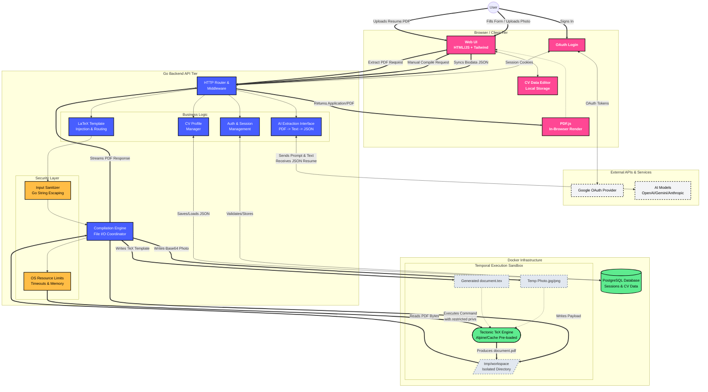

# ATSTEX-LAB

A modern, privacy-first LaTeX CV builder designed to help you generate beautiful, ATS-friendly resumes directly from your browser.

Write your biodata, choose a template, and instantly compile it into a professional PDF.


---

## 🏗️ Architecture & Flow

Atstex-Lab acts as a bridge between a streamlined web frontend and the powerful LaTeX typesetting engine.



### How it Works

1. **Input**: You fill out your professional profile data using the Web UI, which saves securely to your persistent PostgreSQL database profile.
2. **AI Extraction**: Optionally, upload an existing PDF resume. The Go backend sends the text to an AI provider (like OpenAI or Gemini) to intelligently parse and auto-fill your profile.
3. **Compilation**: The backend engine marries your JSON payload with a LaTeX blueprint template, injects uploaded assets (like Profile Photos), and executes `tectonic` in an isolated temporal sandbox to compile the raw `document.tex` into a flawless PDF.

---

## 🚀 Quickstart using Docker

The absolute best way to run ATSTEX-LAB locally is via Docker. This bundles the Go API, PostgreSQL database, and the massive TeX Live compilation engine into a single containerized environment.

### 1. Setup Environment

Clone the repository, then copy the environment variables:

```bash
cp .env.example .env
```

*(Optional)* Add your `GOOGLE_CLIENT_ID` and `AI_API_KEY` to enable OAuth login and AI PDF parsing.

### 2. Run the Stack

Run the makefile command to build the image and start the database:

```bash
make docker-run
```

*Note: The first build will take a few minutes as it downloads and pre-caches the massive Tectonic package bundle.*

### 3. Open the App

Visit [http://localhost:8080](http://localhost:8080) in your browser!

### Common Commands

- `make docker-logs` - Tail the active output logs.
- `make docker-down` - Stop the containers safely.
- `make docker-remove-rebuild` - Nuke the database and container volumes to start fresh.

---

## 🛠️ Local Development (Without Docker)

If you'd like to develop natively without Docker containers, ensure you have **Go 1.22+**, **Node.js**, **PostgreSQL**, and a full LaTeX distribution installed on your machine (`mactex` on macOS or `texlive-full` on Linux).

```bash
# Compile CSS tailwind watchers and boot the Go development server
npm install
make run

# Build the standalone binary
make build
./atstex-lab
```
