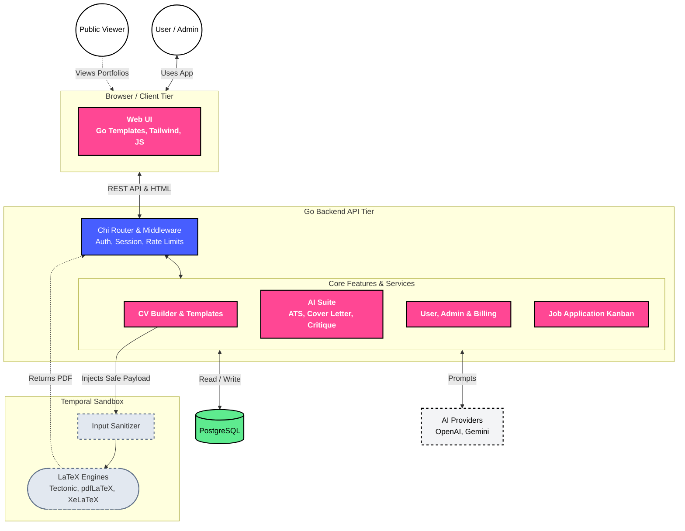

# ATSTEX-LAB

A modern LaTeX CV builder designed to help you generate beautiful, ATS-friendly resumes. Write your biodata, choose a template, and instantly compile it into a professional PDF.

## Table of Contents
- [Preview](#preview)
- [Key Technologies](#key-technologies)
- [Architecture & Flow](#architecture--flow)
- [How it Works](#how-it-works)
- [Quickstart using Docker](#quickstart-using-docker)
- [Dev Commands](#dev-commands)

## Preview


## Key Technologies
- **Core**: Go, strict layered architecture with Chi router.
- **Frontend**: Go HTML Templates, Tailwind CSS, Vanilla JS.
- **LaTeX Engine**: Tectonic (compiled in an isolated temporal sandbox).
- **Data**: PostgreSQL (pgx).
- **Auth & Security**: Google OAuth2 via session cookies.
- **AI Suite**: OpenAI / Gemini integration for CV review, ATS simulation, cover letter generation, mock interview, and PDF extraction.
- **Infrastructure**: Docker, Docker Compose, optimized multi-stage containers.

## Architecture & Flow

Atstex-Lab acts as a bridge between a streamlined web frontend and the powerful LaTeX typesetting engine.



## How it Works

1. **Input**: You fill out your professional profile data using the Web UI, which saves securely to your persistent PostgreSQL database profile.
2. **AI Extraction**: Optionally, upload an existing PDF resume. The Go backend sends the text to an AI provider (like OpenAI or Gemini) to intelligently parse and auto-fill your profile.
3. **Compilation**: The backend engine marries your JSON payload with a LaTeX blueprint template, injects uploaded assets (like Profile Photos), and executes `tectonic` in an isolated temporal sandbox to compile the raw `document.tex` into a flawless PDF.

---

## Quickstart using Docker

The absolute best way to run ATSTEX-LAB locally is via Docker. This bundles the Go API, PostgreSQL database, and the massive TeX Live compilation engine into a single containerized environment.

### 1. Setup Environment

Clone the repository, then copy the environment variables:

```bash
cp .env.example .env
```

Add your `GOOGLE_CLIENT_ID` and `AI_API_KEY` to enable OAuth login and AI Suites.

### 2. Run the Stack

Run the makefile command to build the image and start the database:

```bash
make docker-run
```

_Note: The first build will take a few minutes as it downloads and pre-caches the massive Tectonic package bundle._

### 3. Run Database Migrations

This project uses [golang-migrate](https://github.com/golang-migrate/migrate) to manage the database schema.

1. **Install golang-migrate CLI**:

   ```bash
   brew install golang-migrate
   ```

   _(Or download the binary from their [releases page](https://github.com/golang-migrate/migrate/releases) if not on macOS)._

2. **Run Migrations**:
   Once your database is running via Docker, execute the migrations:

   ```bash
   make migrateup
   ```

### 4. Open the App

Visit [http://localhost:8080](http://localhost:8080) in your browser!

## Dev Commands

Common commands for development and operations:

| Command | Description |
|---|---|
| `make docker-run` | Build and start the full Docker stack |
| `make docker-logs` | Tail the active output logs |
| `make docker-down` | Stop the containers safely |
| `make docker-remove-rebuild` | Nuke the database and container volumes to start fresh |
| `make migrateup` | Run all database migrations |
| `make migratedown` | Revert all migrations |
| `make migrateup1` / `make migratedown1` | Run/revert exactly one migration |
| `make new_migration name=<name>` | Generate new empty up/down migration files |
