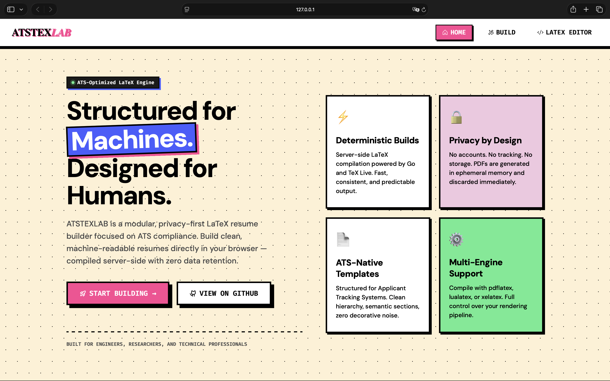
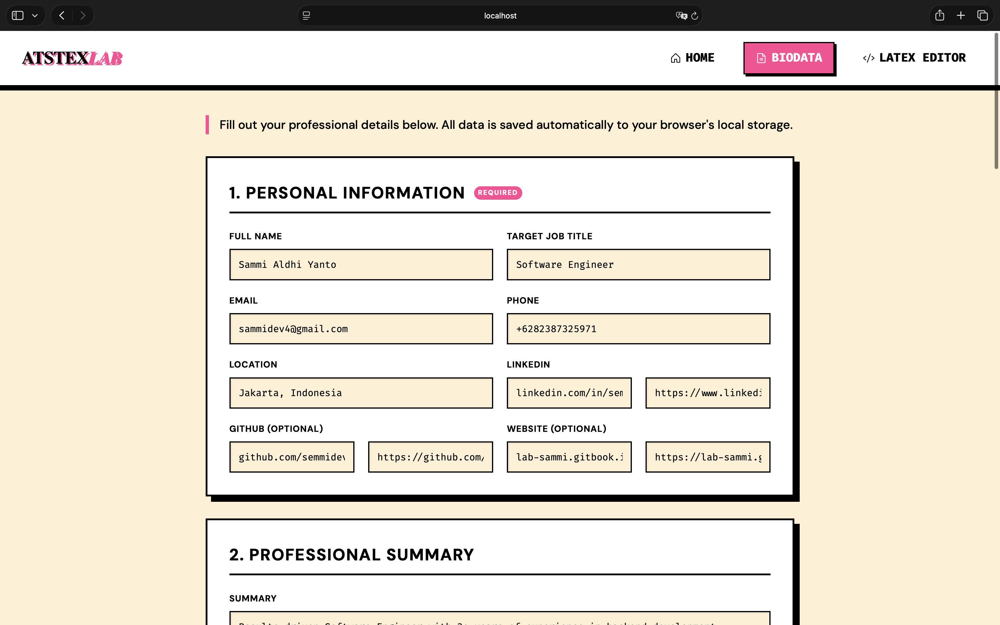
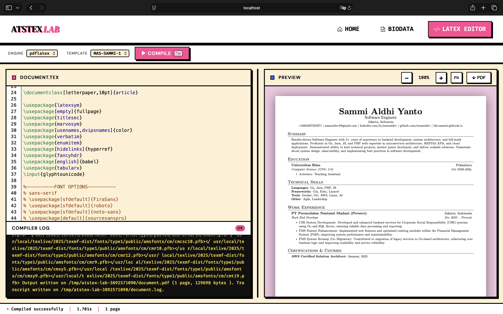

# ATSTEXLAB — Engineered ATS Resume Builder





A minimal, self-hosted LaTeX compiler and previewer tailored for building ATS-friendly resumes. Write LaTeX in the browser using curated professional CV templates, compile server-side with pdflatex/xelatex/lualatex, and preview the PDF instantly.

## Features

- **ATS-Friendly CV Templates**: Dynamically load and select from professionally engineered LaTeX CV templates
- **Split-pane editor** with syntax-aware tab handling and `Ctrl+Enter` shortcut
- **Multi-engine**: pdflatex, xelatex, lualatex — switchable per document
- **Live PDF preview** via PDF.js — multi-page, zoomable, draggable splitter
- **Compiler log** with error/warning line highlighting
- **Download PDF** directly from the browser
- **No data stored** — every compile runs in an isolated temp dir, wiped immediately after

---

## Quickstart (Docker — recommended)

No need to install TeX Live locally. The container ships with a full TeX Live installation.

```bash
# Build image and start (first run pulls ~4 GB texlive/texlive:latest)
make docker-run

# Or in background
make docker-up
```

Open **http://localhost:8080**.

---

## Local Development (without Docker)

### Requirements

- Go 1.22+
- TeX Live with the engines you want to use

### 1. Install TeX Live

```bash
# Ubuntu / Debian — installs all required engines and packages
make install-latex
```

Or manually:

```bash
sudo apt-get install -y \
  texlive-latex-extra texlive-fonts-recommended \
  texlive-xetex texlive-luatex latexmk
```

### 2. Run

```bash
go mod tidy
make run
# open http://localhost:8080

# Custom port
ADDR=:3000 make run
```

### 3. Build binary

```bash
make build
./atstex-lab
```

---

## Makefile Reference

| Target | Description |
|---|---|
| `make run` | Run dev server locally |
| `make build` | Compile binary to `./atstex-lab` |
| `make tidy` | Run `go mod tidy` |
| `make clean` | Remove compiled binary |
| `make docker-run` | Build image + start container (foreground) |
| `make docker-up` | Build image + start container (background) |
| `make docker-down` | Stop and remove container |
| `make docker-build` | Build Docker image only |
| `make docker-logs` | Tail container logs |
| `make install-latex` | Install TeX Live on Ubuntu/Debian |

---

## Project Layout

```
atstex-lab/
├── cmd/server/main.go          # Entry point — Chi router + middleware stack
├── internal/
│   ├── compiler/compiler.go    # LaTeX engine abstraction (runs engine 2×, isolated temp dir)
│   └── handler/handler.go      # HTTP handlers (Index, Compile)
├── web/
│   ├── embed.go                # go:embed — assets baked into the binary
│   ├── templates/              # HTML views and LaTeX CV templates
│   └── static/                 # Static assets served at /static/
├── Dockerfile                  # Multi-stage: Go builder → texlive/texlive:latest
├── docker-compose.yml
├── .dockerignore
├── go.mod
├── Makefile
└── README.md
```

---

## Docker Details

The image uses a **multi-stage build**:

1. **Stage 1** (`golang:1.22-alpine`) — compiles a static Go binary (~10 MB)
2. **Stage 2** (`texlive/texlive:latest`) — official full TeX Live image; the binary is copied in

The final container has pdflatex, xelatex, lualatex, latexmk, and virtually every CTAN package available out of the box.

Security posture:
- Runs as a non-root user (`atstex-lab`)
- `/tmp` is a `tmpfs` RAM disk — compile artifacts never touch the host disk
- CPU and memory capped via `deploy.resources` in `docker-compose.yml`

---

## API

### `POST /compile`

**Request** (JSON):
```json
{
  "source": "\\documentclass{article}\\begin{document}Hello\\end{document}",
  "engine": "pdflatex"
}
```

`engine` accepts `pdflatex`, `xelatex`, or `lualatex`. Defaults to `pdflatex` if omitted.

**Success** — `200 OK`, `Content-Type: application/pdf`

Response body is the raw PDF binary. Metadata is returned in headers:

| Header | Example | Description |
|---|---|---|
| `X-Latex-Elapsed` | `1.23s` | Total compile time |
| `X-Latex-Log` | `...` | Compiler log (truncated to 8 KB) |
| `X-Latex-Engine` | `pdflatex` | Engine used |

**Error** — `422 Unprocessable Entity`, `Content-Type: application/json`

```json
{ "ok": false, "error": "compilation failed", "log": "..." }
```
